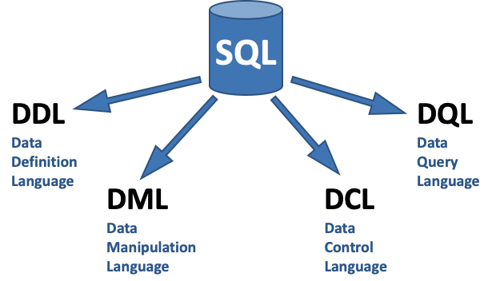

# SQL-Cheatsheet
Welcome to the SQL Cheatsheet repository!  
This cheatsheet is a comprehensive collection of commonly-used SQL queries and commands, organized by topic (e.g. DDL, DML, etc.). Our goal is to make it easy for developers, data analysts, and database administrators to quickly find and use the SQL commands they need.

To contribute to the cheatsheet, please follow these guidelines:
- Make sure your contributions align with the theme and scope of the cheatsheet.
- You can submit a pull request with your changes. Please make sure that your pull request follows the same formatting and style as the rest of the cheatsheet.
- The pull request will be reviewed by the maintainers of the repository, who will check if the changes align with the scope of the cheatsheet and that it is formatted correctly.
- Once the pull request is approved, it will be merged into the cheatsheet.

Thank you for your contributions to this community-driven project!

# Table of Content

## About SQL
### Main Features
- SQL is a declarative, set- and table-oriented language
- SQL lacks features of a programming language
- No undo feature!
- Not case-sensitive
- Recommendation: use uppercase for keywords, lowercase for table and column names
- Arbitrary use of spaces, line breaks, and tabs is allowed.

### Language Areas
SQL is the standard language and interface for:
- Defining (DDL)
- Managing access (DCL)
- Manipulating (DML)
- Querying (DQL) relational databases.

([Back to top](#sql-cheatsheet))
## Data Definition Language (DDL)
### CREATE
### ALTER
### DROP
### TRUNCATE
### SQL KEYS

([Back to top](#sql-cheatsheet))
## Data Manipulation Language (DML)
### INSERT
### UPDATE
### DELETE
### CASCADING
### MERGE

([Back to top](#sql-cheatsheet))
## Data Query Language (DQL)
### SELECT
### WHERE
### CASE
### JOIN
### GROUP
### SUBQUERIES
### SET OPERATIONS

([Back to top](#sql-cheatsheet))
## Views
### CREATE
### QUERY
### EDIT
### DELETE

([Back to top](#sql-cheatsheet))
## Data Security
### AUTHENTICATION
### AUTHORIZATION
### ROW LEVEL SECURITY
### DYNAMIC DATA MASKING
### ENCRYPTION

## Data Backup

([Back to top](#sql-cheatsheet))
